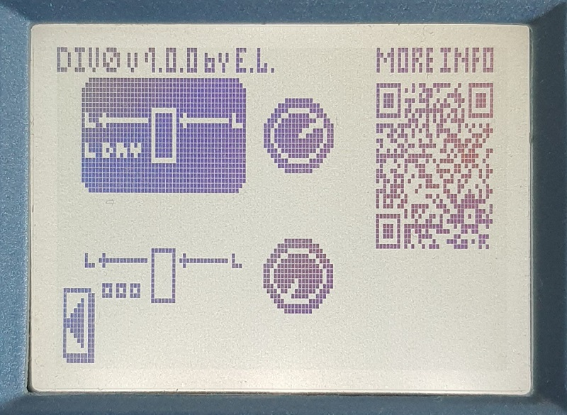

# Спонсоры! Sponsors!
🥇 Не все герои носят плащи! Марк, золотой спонсор, человек, который поверил и вложился в это дело до того, как у меня были результаты на руках.

🥇 Not all heroes wear capes! Mark, gold sponsor, person who believed and financed this endeavor before I had results to show.

[ YouTube](https://youtube.com/channel/UCuNjQLWeYezMKmJBICgsn2g) [ VK](https://vk.com/club23918120) [ Telegram](https://t.me/markambient)

# 🔥 RTFM ⥢ Div0 🔥
Позволяют использовать разные эффекты для L и R, особенно интересен для CDR. Плюсы, минусы и подводные камни [тут](howto/Div0.ru.md) и [тут](howto/RTFM.ru.md).

Allow to use different effects for L and R, especially good for CDR. Read more [here](howto/Div0.en.md) and [here](howto/RTFM.en.md).

 ⥢ 

# RainSel
Позволяет смешивать чистый и обработанный сигналы, или выводить их по отдельности на L и R. Подробности [тут](howto/RainSel.ru.md).

Allows to mix dry and wet signals, or output them independently on L and R. Read more [here](howto/RainSel.en.md).

# Я хочу использовать эффект, что делать / I want to use one of the FX, what do I do
Следуй инструкции [здесь](howto/README.ru.md).

Follow instructions in [here](howto/README.en.md).

# Now to the software development and official README
## First of all
This is by no means supported or otherwise authorized by Zoom Corporation.

I do not post any materials that are made by Zoom Co, explicitly. I would rather not post something I am not sure about, thus some of materials are vague and expect that interested reader can arrive to same discoveries and conclusions given the tools I talk about.

You may see Zoom Co related imagery in media files I use for demonstration. All images, fonts and names are property and trademark of Zoom Co and I do my best to use them fairly.

YouTube logo used in this README and other written materials is downloaded from [Wikimedia Commons](https://commons.wikimedia.org/wiki/File:YouTube_social_white_squircle.svg). This project has no relation or affiliation with YouTube, I only use their logo as signifier of where link directs to.

VK logo used in this README and other written materials is downloaded from official press / media kit. This project has no relation or affiliation with VK, I only use their logo as signifier of where link directs to.

Telegram logo used in this README and other written materials is downloaded from official press / media kit. This project has no relation or affiliation with Telegram, I only use their logo as signifier of where link directs to.

If you (whoever you are, personal or corporate) see something that infringes on your property, let me know. I will work it out with you to my best speed possible, down to removal if that is only way to settle it.

## Will this break my device?
If it is not clear from LICENSE: all things you do based on what you read or find here are your responsibility. I do not post what did not work for me, but I cannot know what will work for you. Risks are not much higher, in my opinion, compared to flashing new version of official firmware.

That said, do not try this night before the gig. Just keep the unit in the board, and return when it is not so hot.

## On full .asm files, if that was not clear
Do not ask for “full source code” or “full assembly” for FX. That is not mine to publish or reproduce. Situation here is exactly the situation with RomHacks for cartridge games: I have the hardware -> I modify the original -> I post difference -> You apply it onto original you should legally have. This is why I chose IPS format, because I feel this is more RomHack that anything.

## Where do I start if I want to do something similar?
Glad you asked, visit [library](library/README.md) for text descriptions and useful links, and [DYI section](diy/README.md) for hands-on materials such as scripts and so on.

## Dibs
I call dibs on sorting index `0xF1` (decimal `241`) across all effect types. I will use sub-indexes if I have more than one effect in category.
