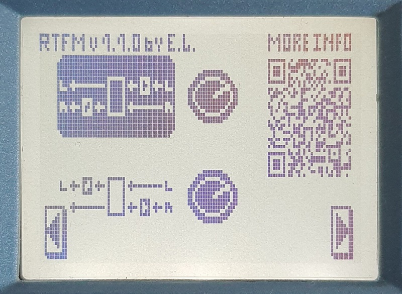

# RainSel 
Media:

  
  
  
  I uploaded a video demo where you can hear L/R channels and corresponding knob positions.
  
  I recommend using headphones to tell left and right channels apart. Be careful with volume, sound does not start right out, and _beep_ I used may be startling.
  
  [Video demo](media/rainsel_demo.mp4)
  
  This video has compression of around 4 out of 9 [f***g jackals](http://seo-revizor.ru/grandmotors-inzhiniringovye-ebanisticheskie-resheniya/). Meh. Works for me, I am not a video artist.

# RTFM
Media:

  
  
  
  No on-effect video, I don't own MS-70CDR now so I cannot record it.  

# I want to try out one of the FX, what do I do
Follow instructions in [here](howto/README.md).

# I want to tip you some $
Why thank you! See expandable section for more.

  
  I really wanted to use Github Sponsor option, but it is currently (ever?) not available in Russia. When it is available, I will migrate to it, if I ever have a need.
  
  Please read some items below, and proceed if you want.
  
  First of all, I don't need your last money. These are, as usual, trying times, so make sure to take care of yourself before you tipping a stranger. I do this for myself and my fun, and hope for community to catch my ideas up. Use and have fun.
  
  Second, I don't want regular donations. I don't see myself doing this on repeated basis, at least for now, so let's keep this non-commitment. Rather, think of buying me a coffee when you find these pages useful.
  
  And finally, "tipping" does not mean "hiring". I don't take commissions, don't teach or promise to deliver X if I get Y. Have questions - ask them, I will answer them for free if I can. Have suggestions? Fire away. Want to discuss something? Sure. Money will not be a factor here. Plus, I will not list any "sponsors", "patrons", whatever, with just a tipping page. With Github Sponsors I think it is automated and easy, and I will gladly do that, when (if) it is available. Manually - I would rather spend my time on something else.
  
  With that in mind:
  
  Russian tipping provider is ЮMoney
  
  
  
  It has least commission for me to take money out, but it does not work for everyone.
  
  As alternative, use Ko-Fi.
  
  
  
  Any tips there do a round-trip across the world, though.

# What are those small patch cables?
They are original Russian development produced and sold by [LexCable](https://www.lexcable.ru/).

If you are interested, give them a visit and support them with a purchase. They are small independent business that need every bit of funds.

# Now to the full README
## First of all
This is by no means supported or otherwise authorized by Zoom Corporation.

I do not post any materials that are made by Zoom Co, explicitly. I would rather not post something I am not sure about, thus some of materials are vague and expect that interested reader can arrive to same discoveries and conclusions given the tools I talk about.

You may see Zoom Co related imagery in media files I use for demonstration. All images, fonts and names are property and trademark of Zoom Co and I do my best to use them fairly.

ЮMoney logo used in this README is downloaded from official press / media kit. This project has no relation or affiliation with ЮMoney, I only use them as tips provider.

Ko-fi button used in this README is linked from official website. This project has no relation or affiliation with Ko-fi, I only use them as tips provider.

If you (whoever you are, personal or corporate) see something that infringes on your property, let me know. I will work it out with you to my best speed possible, down to removal if that is only way to settle it.

## Will this break my device?
If it is not clear from LICENSE: all things you do based on what you read or find here are your responsibility. I do not post what did not work for me, but I cannot know what will work for you. Risks are not much higher, in my opinion, compared to flashing new version of official firmware.

That said, do not try this night before the gig. Just keep the unit in the board, and return when it is not so hot.

## On full .asm files, if that was not clear
Do not ask for “full source code” or “full assembly” for FX. That is not mine to publish or reproduce. Situation here is exactly the situation with RomHacks for cartridge games: I have the hardware -> I modify the original -> I post difference -> You apply it onto original you should legally have. This is why I chose IPS format, because I feel this is more RomHack that anything.

## Where do I start if I want to do something similar?
Glad you asked, visit [library](library/README.md) for text descriptions and useful links, and [DYI section](diy/README.md) for hands-on materials such as scripts and so on.

## Dibs
I call dibs on sorting index `0xF1` (decimal `241`) across all effect types. I will use sub-indexes if I have more than one effect in category.
