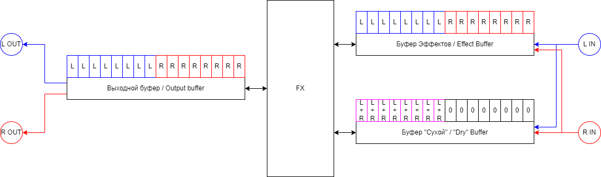
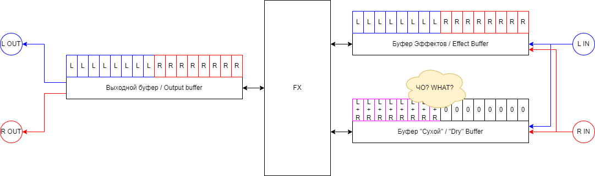
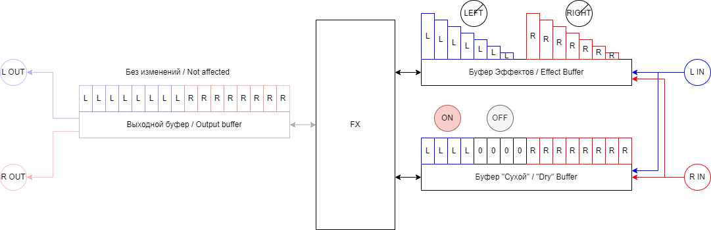

# Div0
## About this document
This is a page with instructions for Div0 v1.0.0

Be sure that you are reading correct version.

If you followed the QR code, you should be set, since each release comes with relevant URL embedded.

If you opened this page manually, and version is different, look for tag that matches your version. Corresponding picker is usually to the top left of document view. It usually says something like `main` by default. When clicked, it will provide options `Branches` and `Tags`. Choose `Tags` and choose tag that starts with Div0 and the gives your version.

## What it does
This effect enables other effects to access Dry signals of Left and Right channels separately. Without it, Dry Left is actually a sum of Left and Right, and Dry Right is empty.

Add this effect to your CDR firmware, and put it first. Experiment with knob positions and on/off switch to best suit effects you chose. Each effect that relies on Div0 should come with recommended knob settings.

## Technical details
Here's some diagrams for tech-minded.

First of all, here is how three buffers are working originally:

Fx buffer has 8 samples of Left channel, then 8 samples of Right channel from the same time.

Dry buffer has 8 samples of Left + Right, then 8 samples of silence.

Output buffer has 8 samples of Left channel, then 8 samples of Right channel from the same time.

As far as I can tell, by default, each effect reads from Fx buffer, applies its function to it, and writes over to Fx and Output buffer. Dry buffer is used as supplement, for example as one of Envelope sources for `ZNR`.

No effect is truly "off", rather in off state it does not apply function actively. IIRC this is how "keep tails" option works. Effect just keeps applying tails, without actively modifying signal anymore.

Another noticeable thing is that buffers are re-used, or appears as such. This means that each effect takes a turn at modifying Fx and Output, rather than some "chain" effect.

Wait, you said 8 samples of Left + Right, and silence...

Yep. I guess for inter-compatibility between Mono in and Stereo in effect units and effects, Dry buffer is sum of Left and Right where only Left should be, and silence on Right. I can guess that Dry buffer is even sized to hold both samples, because I use that space, and nothing crashes.

What was the reasoning is beyond me, but this does not, by itself, allow to access Dry Left and Right individually.

Div0 is there to fix exactly that:

First of all, it does not even read Output buffer. Saves CPU, not needed.

It manipulates Fx and Dry buffers only.

On Fx buffer, it applies corresponding volume control to each channel. This allows to silence a channel to next effect, by moving corresponding volume to 0.

On Dry buffer, for Left channel, operation depends on a Div0 state:
  * When it is On (LED is lit) Fx left channel is written to Dry Left, replacing sum. This allows to "smuggle" Dry Left to next effects independent of Dry Right.
  * When it is Off (LED is off) silence is written to Dry Left. It is a fail-safe, in case following effect mixes it back to Fx.

On Dry buffer, for Right channel, it is simply written with Fx buffer. This means, if Div0 is first in the chain, silence is replaced with Dry Right.

In total, Dry Left and Right are now available on relatively safe buffer to be used on following effects.

## Tips
If you found this useful, you can leave me some tips, instructions are [here](../README.md#i-want-to-support-you-with-money).
