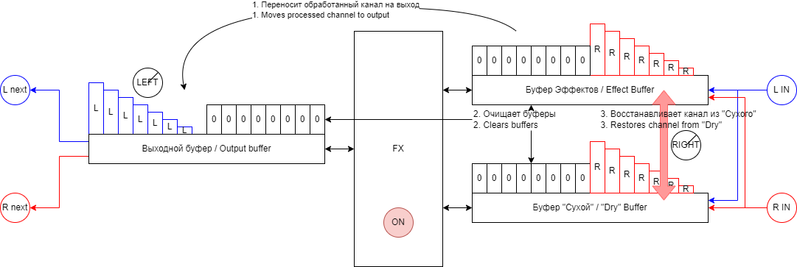

# RTFM
## Об этом документе
Это страница с инструкциями к RTFM v1.1.0

Убедись что версии в эффекте и в документе совпадают.

Если ты отсканировал(а) QR код, то все тип-топ, в каждый релиз вшита соответствующая ссылка.

Если ты открыл(а) эту страницу вручную, и версии не совпадают, нужно найти tag который подходит к твоей версии. Нужная менюшка обычно находится сверху слева от документа. По умолчанию там написано что-то типа `main`. Если на нее нажать, появятся варианты `Branches` и `Tags`. Выбираешь `Tags`, выбираешь из RTFM нужную версию.

## Об эффекте
В основном мод был задуман для работы с MS-70CDR, чтобы можно было обрабатывать два сигнала независимо.

Для работы требуется [Div0](Div0.md), иначе будет смешивать левый и правый каналы, и вообще говнить.

На Div0 рекомендую начать с LEFT 0, RIGHT 100, ON. Далее кнопку в нем переключать только если какой-то эффект будет подмешивать чистый сигнал слева в общий микс. При "выключении" есть шанс что пропадет больше, чем нужно.

## Как использовать
TL;DR: большинство эффектов можно ставить до, _только стерео_ эффекты работают адекватно после. Только стереоэффекты _с независимыми каналами_ работаю зашибись.

Первым идет Div0. Затем эффекты 1 группы. Затем RTFM. Затем эффекты 2 группы. Если звезды сошлись, то один канал обрабатывается 1 группой, а другой 2 группой. Кнопка переключает какой канал какой группой обрабатывается.

Этот мод не _волшебный_, и результаты у него соответственно не _волшебные_. Второй вход не появится, моноэффект в стерео не превратит.

Для адекватной работы эффекты во второй группе не должны смешивать каналы между собой. Т.е. на 100% хорошо будут работать только стереоэффекты с независимой обработкой. Например, `DriveEcho`, `CoronaTri` и другие.

В первой группе можно попробовать все. Если в эффекте нет совсем уж странных решений, то и моно-эффекты заработают. Я пробовал на питчерах, все окай.

Для заинтересованных, есть диаграмма того, что эффект делает:

Пример сделан для состояния ВКЛ, когда 1 группа обрабатывает Левый канал. Когда эффект в состоянии ВЫКЛ, каналы просто меняются логикой.

## В добрый путь
Этот мод работает в рамках всех ограничений, с которыми сталкиваются родные эффекты по части стерео обработки, и еще немного сверху. На мой взгляд, Зумовцы и так много сделали для создания стерео эффектов, а этот мод дожимает мультистомп по своего предела. Так что экспериментируй.

## Поддержать материально
Если эффект пригодился, можно оставить чаевые, как это сделать написано [здесь](../README.md#хочу-поддержать-материально).
